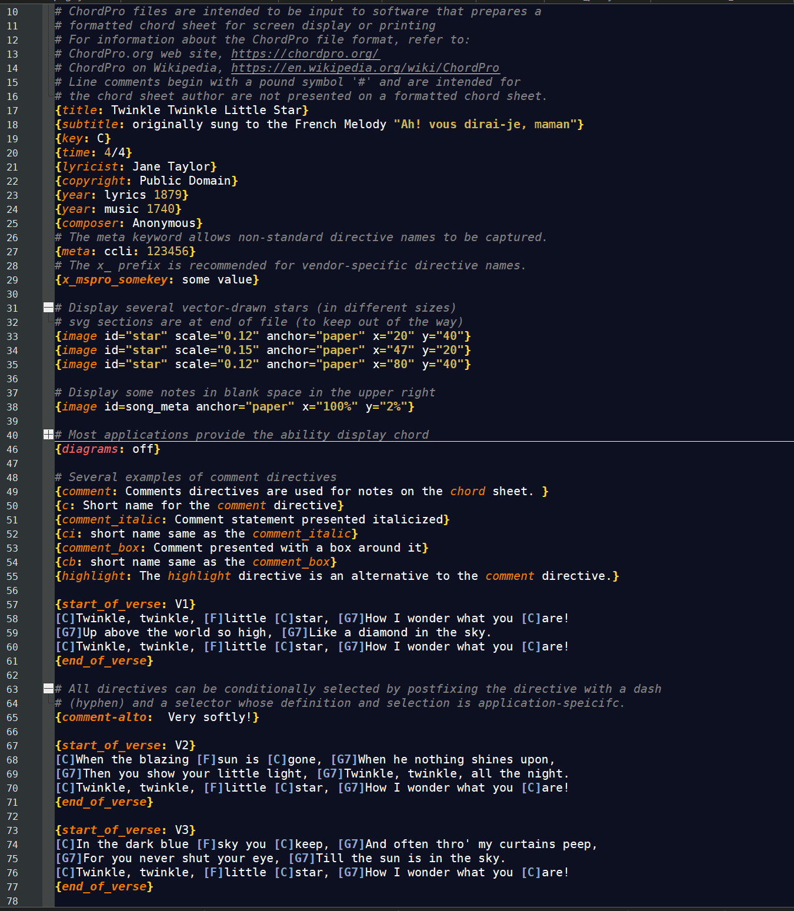
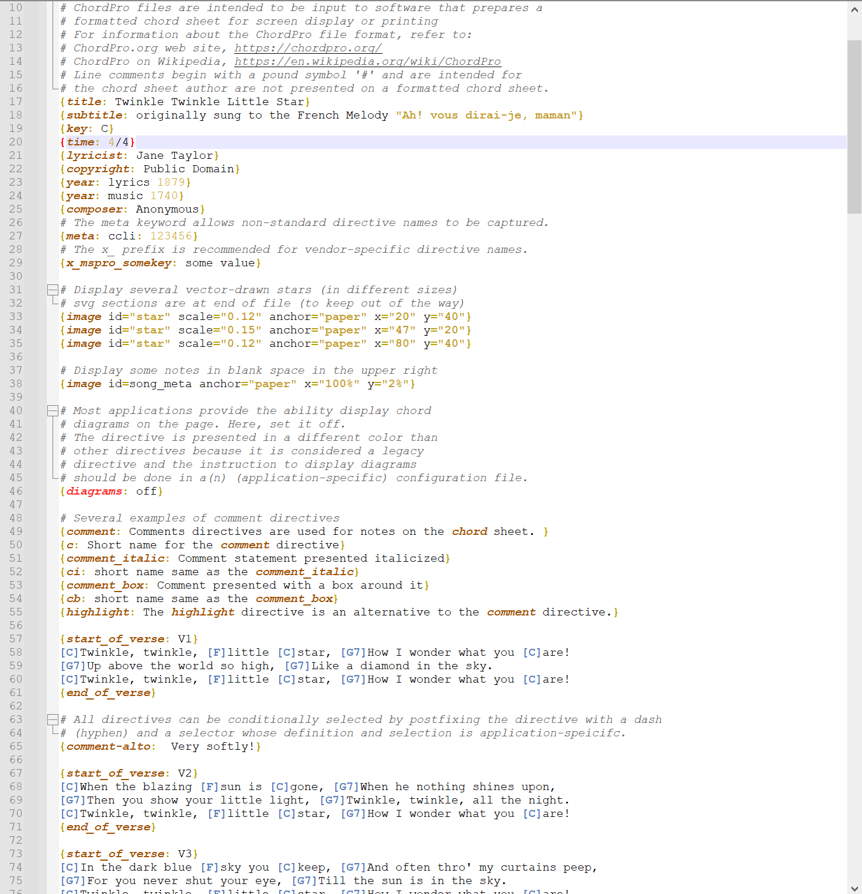

# Notedpad++ User Defined Language for ChordPro

Notepad++ User Defined Language (UDL) for the ChordPro file format.

## Table of Contents

- [Description](#description)
- [Instalation](#installation)
- [Usage](#usage)
- [License](#license)

## Description
Notepad++ is a free and open-source text and source code editor for use with Microsoft Windows. [Wikipedia](https://en.wikipedia.org/wiki/Notepad%2B%2B)

Notepad++ comes prepackaged with many Language lexers, which apply syntax highlighting to source code or textual data. However, not every possible language or formatting style is available. Enter the User Defined Languages (or “UDL” for short): the UDL interface allows the user to define rules for formatting normal text, keywords, comments, numbers; to define delimiters (like quotes around strings or parentheses around lists) which will cause text between those delimiters to be formatted; and to define symbols or keywords that can be used to allow folding (on-demand hiding and unhiding of blocks of code or text).
(https://npp-user-manual.org/docs/user-defined-language-system/)

The [ChordPro](https://www.chordpro.org/) format is a  text-based markup language for representing chord charts by describing the position of chords in relation to the song's lyrics (i.e., where they belong in the song), song sections, and song metadata (i.e., information about the song).

Although human-readable, this format is intended to be provided as input to a computer
program that transforms it into PDF, HTML, or display on the screen.

This project provides a User Defined Language (UDL) definition for the ChordPro format. 
Two definition files are provided; one for use when the Notedpad++ interface is in Light Mode and one for dark mode.
A sample ChordPro file that exercises a variety of ChordPro directives can be found in the [UDL-samples](UDL-samples/) directory.

The images below depict the syntax highlighting in action in the dark mode and light modes.

     
    &nbsp;&nbsp;&nbsp;&nbsp;&nbsp;&nbsp;&nbsp;&nbsp;&nbsp;&nbsp;
    | 

## Installation
Follow these steps to add a new User Defined Language to your Notepad++ installation.

1. Decide whether to download the UDL for light or dark mode from the [UDLs] folder.
2. Select Notepad++'s menu entry, **Language > User Defined Language > Open User Defined Language folder...** to open the Windows File Explorer at the `userDefineLangs\` folder.
Copy the path from the file Explorer location bar for pasting into the **Save As** dialog in the next step.
3. Download the UDL file  from the Releases page or by using the "Raw" button on the file's page to display the UDL source. From here, you can either:
    - use your browser's **Right Click > Save As...** feature to save the raw XML file to the `userDefineLangs\` folder found from the previous step.
    - copy and paste the file's content into a new file in Notepad++ and then save it as an XML file to the `userDefineLangs\` folder.
   - **Warning:** Do not just right click to try to download the file from the directory listing links. This will download the GitHub web page for that file (which is HTML, and _not_ the UDL's XML file) and will _not_ work.
   - For additional information, refer to ["Import a UDL" section](https://npp-user-manual.org/docs/user-defined-language-system/#import-a-udl) in the official Notepad++ online user manual.
4. Restart Notepad++ in order for it to detect the new UDL.
5. You can download the sample ChordPro file from the `UDL-samples` folder to confirm Notedpadd++ loaded the UDL file. Once you open the sample restarting Notepad++, it should apply the syntax highlighting.

## Usage
The UDL file should automatically recognize the following file extensions as being in ChordPro format: _.cho_, _.pro_, _.crd_, _.chopro_, and _.chordpro_.
If you use a different extension, you can manually select the UDL from the **Language** menu item.

## Known Issues

- Chordpro directive names that appear within comment or lyric text will be highlighted when it should be ignored.

## License

This extension is licensed under the [MIT License](LICENSE).
